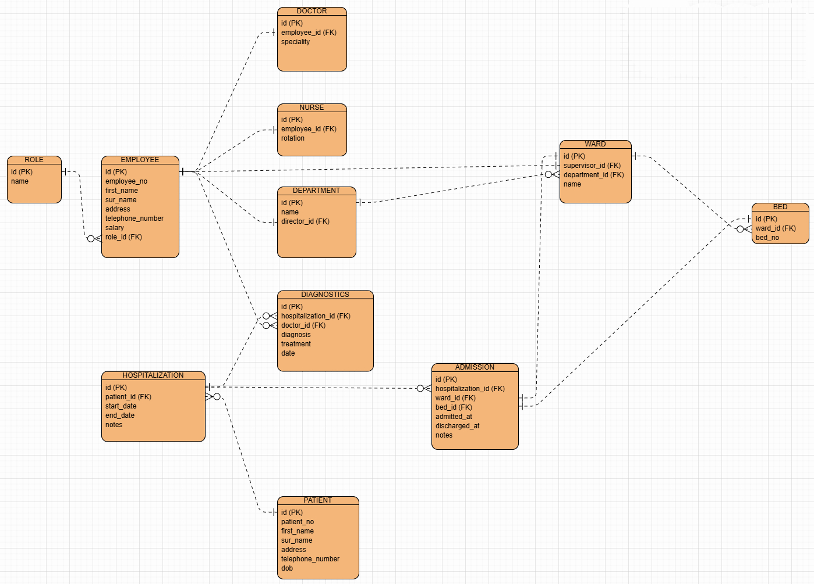

# LAB: Hospital Information System

## Overview

The goal is to design and implement a hospital information system that organizes and manages hospital data efficiently.
It involves entity identification, database schema design, and system integration.

## Entity Relationship Diagram

## ERD Overview

The design follows an **Entity-Relationship Model** where:

- **Employees** (doctors and nurses) are generalized under one table.
- Specializations, rotations, and roles are modeled appropriately using separate tables where needed.
- **Patients** are admitted, diagnosed, and tracked over multiple hospital visits.
- Referential integrity is maintained with foreign keys, and historical data (like transfers) is preserved.

## Core Entities

### `employee`

Represents hospital staff (both doctors and nurses).

| Field  | Type    | Notes                   |
|--------|---------|-------------------------|
| id     | SERIAL  | Primary Key             |
| name   | VARCHAR |                         |
| role   | VARCHAR | 'doctor' or 'nurse'     |
| salary | NUMERIC | Common to all employees |

### `doctor`

Details specific to doctors.

| Field       | Type    | Notes                      |
|-------------|---------|----------------------------|
| employee_id | INT     | FK to `employee(id)`       |
| specialty   | VARCHAR | Doctor's area of expertise |

### `nurse`

Details specific to nurses.

| Field       | Type    | Notes                  |
|-------------|---------|------------------------|
| employee_id | INT     | FK to `employee(id)`   |
| rotation    | VARCHAR | Schedule/rotation info |

### `department`

Hospital department unit.

| Field       | Type    | Notes                       |
|-------------|---------|-----------------------------|
| id          | SERIAL  | Primary Key                 |
| name        | VARCHAR |                             |
| director_id | INT     | FK to `doctor(employee_id)` |

### `ward`

Represents a ward within a department.

| Field         | Type    | Notes                      |
|---------------|---------|----------------------------|
| id            | SERIAL  | Primary Key                |
| name          | VARCHAR |                            |
| department_id | INT     | FK to `department(id)`     |
| supervisor_id | INT     | FK to `nurse(employee_id)` |

### `bed`

Physical beds in wards.

| Field   | Type   | Notes                  |
|---------|--------|------------------------|
| id      | SERIAL | Primary Key            |
| ward_id | INT    | FK to `ward(id)`       |
| number  | INT    | Bed number in the ward |

### `patient`

Hospital visitors/clients.

| Field | Type    | Notes       |
|-------|---------|-------------|
| id    | SERIAL  | Primary Key |
| name  | VARCHAR |             |

### `hospitalization`

Tracks a patient's single hospital visit.

| Field      | Type   | Notes               |
|------------|--------|---------------------|
| id         | SERIAL | Primary Key         |
| patient_id | INT    | FK to `patient(id)` |
| start_date | DATE   |                     |
| end_date   | DATE   | Nullable            |

### `diagnostic`

Doctor's assessment or treatment.

| Field       | Type   | Notes                       |
|-------------|--------|-----------------------------|
| id          | SERIAL | Primary Key                 |
| doctor_id   | INT    | FK to `doctor(employee_id)` |
| patient_id  | INT    | FK to `patient(id)`         |
| date        | DATE   | Date of diagnostic          |
| description | TEXT   | Details                     |

### `admission`

Patient assignment to a ward (and optionally a bed).

| Field              | Type   | Notes                              |
|--------------------|--------|------------------------------------|
| id                 | SERIAL | Primary Key                        |
| hospitalization_id | INT    | FK to `hospitalization(id)`        |
| ward_id            | INT    | FK to `ward(id)`                   |
| bed_id             | INT    | FK to `bed(id)` (optional)         |
| start_date         | DATE   |                                    |
| end_date           | DATE   | Nullable (for current assignments) |

Each new row in `admission` (with same `hospitalization_id`) represents a **transfer** during the same hospitalization.

## The user interface implementation summary

- Simple designs
- The user interface has 2 pages, the main page and the add new patient page.
- Uses error labels, feedback/warning/error alerts, confirmation dialog boxes and <b>Regex expressions</b> to enforce
  input validation along a decent user experience.

## Features implemented

- Create patient
- List all patients
- delete patient
- View patient details
- Search patient by name

## Stack

- Java 21
- JavaFX (Scenebuilder,FXML)
- Maven (for dependency management)

## How to run

- Clone the project
- Open in intelliJ IDEA or another JavaFX-Compatible IDE
- Maven adds dependencies automatically
- Make sure to have a postgres instance running
- create a database, call it `hospital_db` to match the hard coded connection string
- Run the `Main` class
- 👍